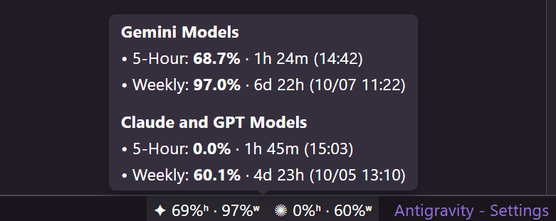
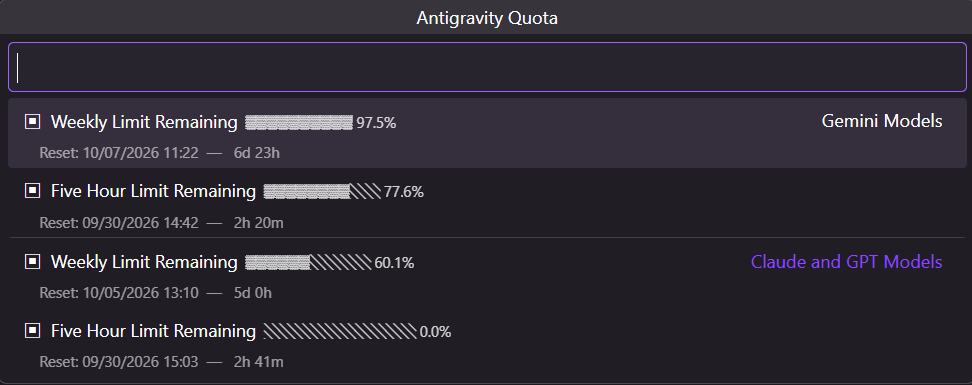

# Antigravity Quota Plus

[](https://github.com/Do-er/antigravity-quota-plus/blob/main/LICENSE)
[](https://marketplace.visualstudio.com/items?itemName=Doer.antigravity-quota-plus)
[](https://open-vsx.org/extension/Doer/antigravity-quota-plus)
[](https://github.com/Do-er/antigravity-quota-plus/issues)

轻量高效的 VS Code / Antigravity 扩展插件，用于在状态栏实时监控各大 AI 模型的 **5小时滑动配额** 与 **周配额** 剩余及刷新倒计时。

---

## 核心特性

- **双限制精准追踪**：同时掌握 Gemini 与 Claude/GPT 模型的 **5-Hour 滑动限制** 与 **Weekly 周限制**。
- **极简状态栏与悬浮卡片**：采用微标角标紧凑呈现，鼠标悬停即浮现清晰的刷新倒计时卡片。
  <p align="center">
    
  </p>
- **自由交互管理菜单**：点击状态栏即可呼出极简菜单，通过几何方块（`▣` / `▢`）自由勾选固定配额项。
  <p align="center">
    
  </p>
- **零配置即开即用**：自动探测 Antigravity 语言服务进程端口与认证凭据，无需任何手动配置。

---

## 配置项

在 VS Code 设置（`Ctrl+,`）中搜索 **AGQ** 进行个性化配置：

| 配置项 | 默认值 | 说明 |
| :--- | :--- | :--- |
| `agq.enabled` | `true` | 是否启用自动配额监控 |
| `agq.pollingInterval` | `120` | 后台轮询间隔时间（秒，最低 30s） |
| `agq.pinnedBuckets` | `[]` | 状态栏显示的配额项 ID 列表（留空默认全部显示） |

---

## 安装方式

### 方式 1：VS Code 扩展市场安装
在 VS Code 或 Antigravity 扩展面板（`Ctrl+Shift+X`）搜索 **`Antigravity Quota Plus`**，点击安装即可。

### 方式 2：VSIX 本地安装
1. 从 Release 页面下载最新的 `.vsix` 文件。
2. 打开扩展面板 -> 点击右上角 `···` -> 选择 **“从 VSIX 安装... (Install from VSIX...)”**。

---

## 本地编译与打包

```bash
# 安装依赖
npm install

# 编译 TypeScript
npm run compile

# 打包为 VSIX 安装包
npm run node:vsix:package
```

---

## 致谢与开源协议
 
- 本项目基于 [Henrik-3/AntigravityQuota](https://github.com/Henrik-3/AntigravityQuota) 等早期社区项目的灵感与实践进行深度增强重构。
- 遵循 [MIT License](https://github.com/Do-er/antigravity-quota-plus/blob/main/LICENSE) 开源协议。
